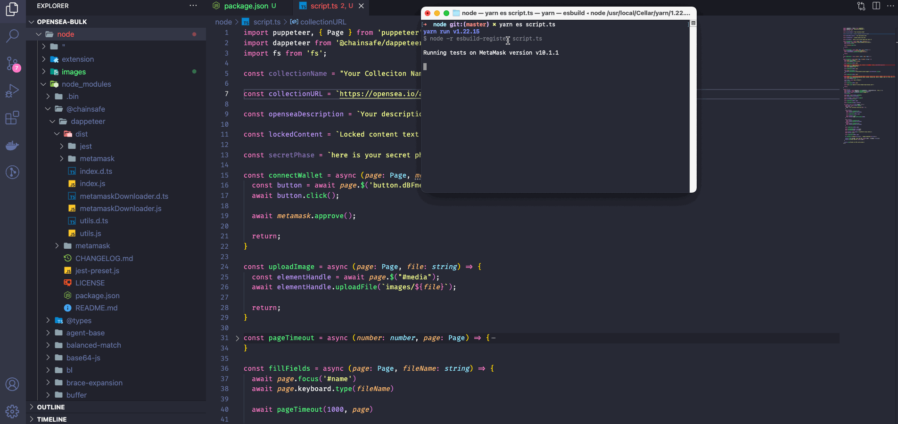

# Opensea BULK Script #

## :computer: About the project

This project was made to mint so many NFTs to the opensea using puppeteer and dappeteer.



## How To Run

First run `yarn install` to install the packages:

``` bash
yarn install
```

Now configure your `script.ts` with your data

```env
const collectionName = "Your Colleciton Name"

const collectionURL = `https://opensea.io/collection/${collectionName}/assets/create`

const openseaDescription = `Your description here`

const lockedContent = `Locked content text here`

const secretPhase = `here is your secret phase dont share it`

```

Run the command to run the script

```bash
yarn es script.ts
```


## Authors

| [<br><sub>@EmanuelCampos</sub>](https://github.com/EmanuelCampos) |
| :------------------------------------------------------------------------------------------------------------------------------: |
